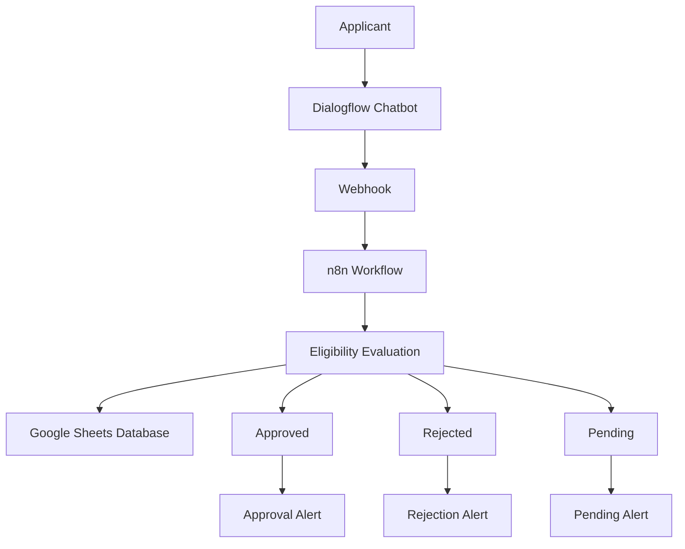

# 🏦 Loan Approval Automation System

An intelligent workflow automation project that streamlines the loan approval process using **Dialogflow**, **n8n**, and **Google Sheets**. The system automates loan application collection, eligibility assessment, record management, and notification delivery, reducing manual effort and improving efficiency.

---

## 📋 Project Overview

The Loan Approval Automation System enables users to apply for loans through a Dialogflow chatbot. The submitted information is automatically processed through an n8n workflow, where predefined eligibility rules determine whether the application should be approved, rejected, or marked as pending.

The application details are stored in Google Sheets, and automated notifications are sent based on the loan status.

---

## 🎯 Objectives

- Automate the loan application process.
- Eliminate repetitive manual work.
- Improve processing speed and accuracy.
- Store applicant data centrally.
- Demonstrate workflow automation using no-code tools.

---

## 🛠️ Technologies Used

| Technology | Purpose |
|------------|---------|
| Dialogflow | Conversational AI Chatbot |
| n8n | Workflow Automation |
| Google Sheets | Data Storage |
| Webhooks | Data Transfer |
| Email Notifications | Status Alerts |

---

## 🏗️ System Architecture



---

## ⚙️ Workflow Process

### Step 1: User Interaction
The applicant interacts with the Dialogflow chatbot and submits loan-related information.

### Step 2: Data Collection
The chatbot collects:
- Applicant Name
- Monthly Income
- Loan Amount
- Employment Details
- Other Required Information

### Step 3: Workflow Trigger
Dialogflow sends the collected information to n8n using a webhook.

### Step 4: Eligibility Check
The workflow evaluates the application using predefined approval criteria.

### Step 5: Data Storage
Application details are automatically stored in Google Sheets.

### Step 6: Status Generation
The application is categorized as:
- ✅ Approved
- ❌ Rejected
- ⏳ Pending Review

### Step 7: User Notification
A corresponding notification is generated and delivered to the applicant.

---

## 📸 Screenshots

### n8n Workflow


### Google Sheets Database


### Approval Notification


### Rejection Notification


### Pending Notification


---

## ✨ Features

- AI-powered chatbot interaction
- Automated loan eligibility evaluation
- Real-time workflow automation
- Google Sheets integration
- Automated status notifications
- Centralized application tracking
- No-code/Low-code implementation

---

## 📊 Benefits

- Faster loan processing
- Reduced manual intervention
- Improved customer experience
- Accurate record management
- Scalable workflow architecture

---

## 📁 Repository Structure

```text
Loan-Approval-Automation/
│
├── assetapproval-alert.pnj.png
├── assetn8n-workflow.ow.pnj.png
├── assetpending-alert.pnj.png
├── assetrejection-alert.pnj.png
├── assetsgoogle-Sheets.pnj.png
│
└── README.md
```

---

## 🚀 Future Enhancements

- Credit score integration
- Banking API integration
- WhatsApp and SMS notifications
- Analytics Dashboard
- AI-based loan risk assessment
- Automated document verification

---

## 🎓 Learning Outcomes

This project demonstrates practical implementation of:

- Workflow Automation
- Conversational AI
- API Integration
- Business Process Automation
- Data Management
- No-Code Development

---

## 👤 Author

**Divyani Kaushal**

MBA (Finance) | Finance & Risk Management Enthusiast

---

⭐ If you found this project helpful, consider giving it a star on GitHub.
