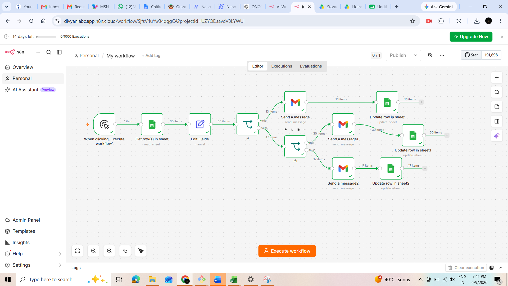
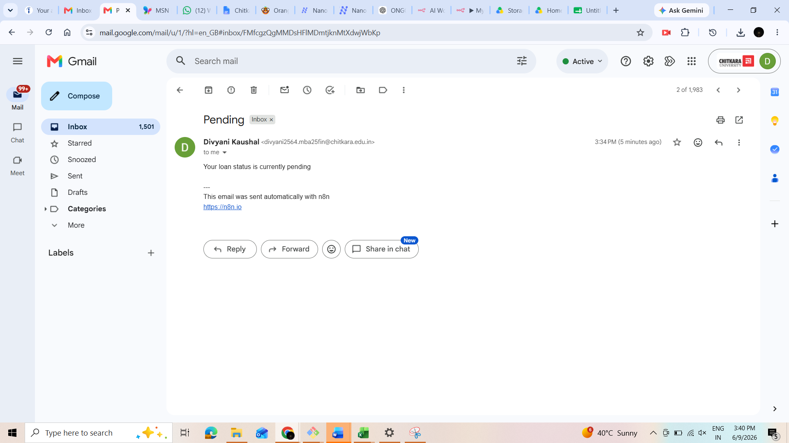

# 🏦 Loan Approval Automation

An automated loan approval workflow built using **n8n**, **Google Sheets**, and intelligent decision-making logic to streamline the loan evaluation process. This project reduces manual effort, speeds up approvals, and provides instant notifications for approval, rejection, and pending alerts.

---

## 📌 Project Overview

The Loan Approval Automation system automatically processes loan applications stored in Google Sheets and evaluates applicants based on predefined eligibility criteria. Depending on the assessment, the system:

- ✅ Approves eligible loan applications
- ❌ Rejects ineligible applications
- ⚠️ Generates pending alerts for risk monitoring
- 📧 Sends automated notifications to stakeholders

The workflow is implemented using **n8n**, enabling seamless integration between data sources and notification services.

---

## 🚀 Features

- Automated loan application processing
- Google Sheets integration for data storage
- Rule-based approval and rejection logic
- Real-time approval notifications
- Automated rejection alerts
- pending/risk monitoring alerts
- No manual intervention required
- Easy to customize approval criteria

---

## 🛠️ Tech Stack

| Technology | Purpose |
|------------|----------|
| n8n | Workflow Automation |
| Google Sheets | Data Storage & Application Tracking |
| Email/Notification Service | Alert Generation |
| Business Rules Engine | Loan Decision Logic |

---

## 📂 Project Structure

---

## 🔄 Workflow Process

### Step 1: Application Submission
Loan applicant details are entered into Google Sheets.

### Step 2: Data Retrieval
n8n automatically fetches new loan applications.

### Step 3: Eligibility Check
The workflow evaluates:
- Applicant income
- Credit score
- Existing liabilities
- Loan amount requested

### Step 4: Decision Making
Based on predefined rules:

- **Approved** → Approval notification generated
- **Rejected** → Rejection notification generated
- **Risk Detected** → Pending alert generated

### Step 5: Notification Delivery
Relevant alerts are automatically sent to stakeholders.

---

## 📸 Workflow Screenshots

### n8n Workflow


### Google Sheets Integration


### Loan Approval Alert


### Loan Rejection Alert


### Pending Alert


---

## 🎯 Business Benefits

- Faster loan processing
- Reduced operational costs
- Consistent decision-making
- Improved customer experience
- Enhanced risk monitoring
- Reduced manual errors

---

## 🔧 Future Enhancements

- AI-based credit risk scoring
- Integration with banking APIs
- Machine Learning approval models
- Dashboard for monitoring applications
- SMS and WhatsApp notifications
- Fraud detection module

---

## 👨‍💻 Author

**divyanikaushal02-cmd**

Developed as an automation solution for streamlining loan approval and monitoring processes using n8n and Google Sheets.

---

## 📄 License

This project is available for educational and demonstration purposes.
```

This README is professional and suitable for a GitHub project submission, internship portfolio, or academic project.
