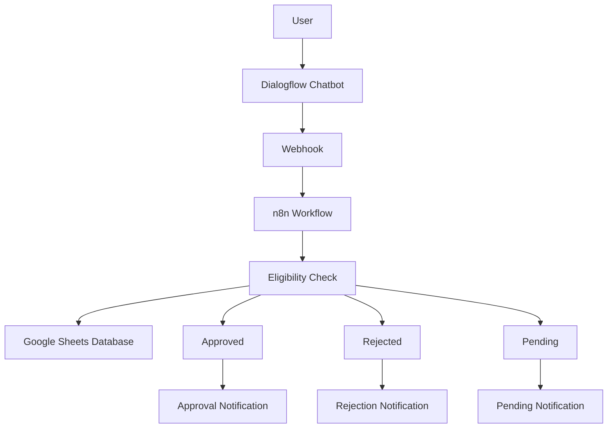

# 🏦 Loan Approval Automation System

An end-to-end loan approval workflow automation project built using **Dialogflow**, **n8n**, and **Google Sheets**. The system automates loan application processing, eligibility verification, record management, and customer notifications, reducing manual effort and improving response time.

---

## 📋 Project Description

The Loan Approval Automation System is designed to automate the initial stages of loan processing through an AI-powered chatbot and workflow automation platform.

Users submit their loan details through a Dialogflow chatbot. The collected information is transferred to an n8n workflow, where predefined business rules evaluate the application. Based on the assessment, the application is marked as:

- ✅ Approved
- ❌ Rejected
- ⏳ Pending Review

The application data is automatically stored in Google Sheets, and status notifications are generated accordingly.

---

## 🎯 Project Objectives

- Automate the loan application process.
- Minimize manual intervention.
- Improve response time for applicants.
- Centralize application records.
- Demonstrate practical implementation of workflow automation tools.

---

## 🛠️ Technologies Used

| Technology | Purpose |
|------------|---------|
| Dialogflow | Conversational AI Chatbot |
| n8n | Workflow Automation |
| Google Sheets | Data Storage |
| Webhooks | Data Exchange |
| Gmail / Email Service | User Notifications |

---

## 🏗️ System Architecture



---

## ⚙️ Workflow

### Step 1: User Interaction
The applicant interacts with the Dialogflow chatbot and provides loan-related information.

### Step 2: Data Collection
The chatbot collects:
- Applicant Name
- Loan Amount
- Monthly Income
- Employment Details
- Other relevant information

### Step 3: Workflow Trigger
The collected data is sent to n8n using a webhook.

### Step 4: Eligibility Assessment
The workflow evaluates the application based on predefined conditions.

### Step 5: Data Storage
Application details are recorded in Google Sheets for future reference.

### Step 6: Decision Generation
The application is categorized as:
- Approved
- Rejected
- Pending

### Step 7: User Notification
A corresponding notification is generated and delivered to the applicant.

---

## 📸 Screenshots

### n8n Workflow


### Google Sheets Database


### Approval Notification


### Rejection Notification


### Pending Notification


---

## ✨ Features

- AI-powered loan inquiry chatbot
- Automated eligibility checking
- Workflow automation using n8n
- Real-time application processing
- Google Sheets integration
- Automated approval, rejection, and pending alerts
- Scalable and easy-to-maintain architecture

---

## 📊 Benefits

- Faster application processing
- Reduced operational workload
- Improved customer experience
- Centralized record management
- Increased process efficiency

---

## 📁 Repository Structure

```text
Loan-Approval-Automation/
│
├── assets/
│   ├── approval-alert.png
│   ├── rejection-alert.png
│   ├── pending-alert.png
│   ├── google-Sheets.png
│   └── n8n-workflow.png
│
├── workflow/
│   └── loan-approval-workflow.json
│
└── README.md
```

---

## 🚀 Future Enhancements

- Credit score verification integration
- Banking API integration
- WhatsApp and SMS notifications
- Loan analytics dashboard
- Machine Learning-based risk assessment
- Document verification automation

---

## 🎓 Learning Outcomes

This project demonstrates practical knowledge of:

- Workflow Automation
- Conversational AI
- API Integration
- Business Process Automation
- Data Management
- No-Code/Low-Code Development

---

## 👤 Author

**Divyani Kaushal**

B.Com (Hons.) | Finance & Risk Management Enthusiast

LinkedIn: *Add your LinkedIn profile here*

---

⭐ If you found this project useful, consider giving it a star on GitHub.
